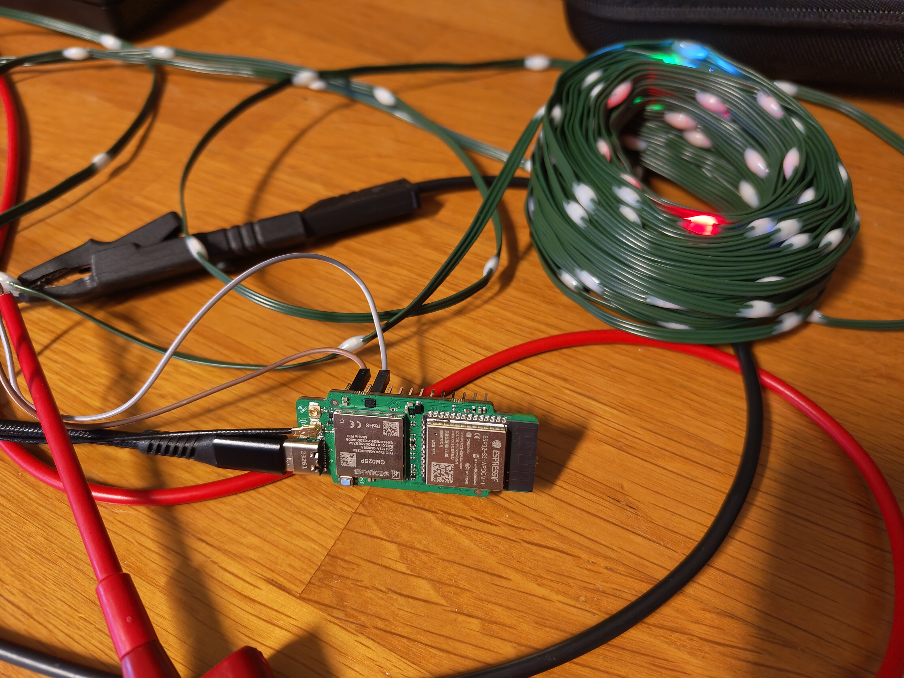

# Walter christmas lights

## Introduction
I'm playing around with a [Walter module](https://www.quickspot.io/) connected 
to a string of WS2812B christmas lights. The goal is to create a webpage that 
I can use to control the color of the LEDs. Throug a 
[BlueCherry.io](https://www.bluecherry.io) IoT connection over LTE-M I should be
able to get relatively low latency.

This is a picture of my test setup:

## The physical tree

The tree was built out of concrete rebar which was welded in a piramid shape. 
The WS2812B LED string is wrapped around it to create the Christmas tree:

